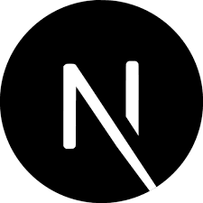

<h1 align="center">Hi 👋, I'm Andrii Antonenko!</h1>
<h3 align="center">A passionate software engineer from Ukraine</h3>

- 🔭 I’m currently working on **[Beliefs](https://beliefs.social/)**

- 💬 Ask me about **node.js, solidity, back-end/web3 development**

- 📫 How to reach me **andriyantonenko3.16@gmail.com**

- 📚 Trying to learn more about **blockchain** and **web3**

- 🤝 Open to new connections and collaboration

- ⚡ Fun fact **I am martial arts lover 🤜**

<h3 align="left">Connect with me:</h3>

  
  

<h3 align="left">Languages and Tools:</h3>

  
  
  
  
  
  
  
  
  
  
  

&nbsp;

